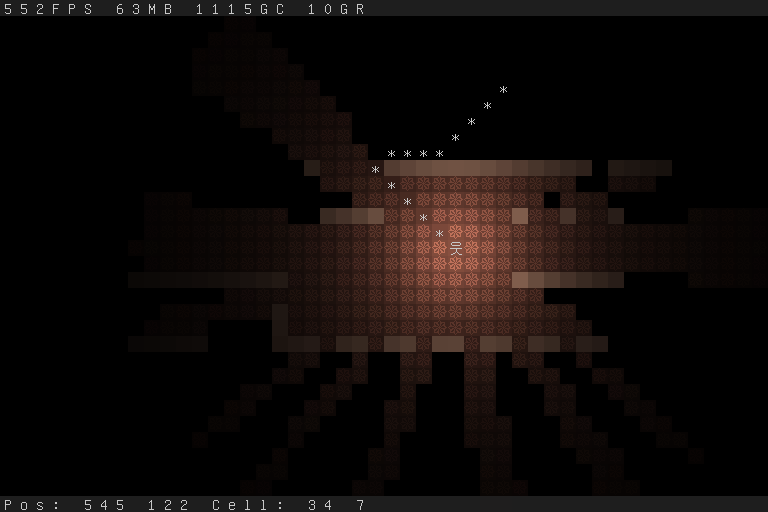

rog
===

* Depends only on skelterjohn/go.wde, so little to no dependencies.
* 32bit, unicode console with built in font has been implemented.

Thanks
------
* Yamamushi [http://www.theasciiproject.com/]